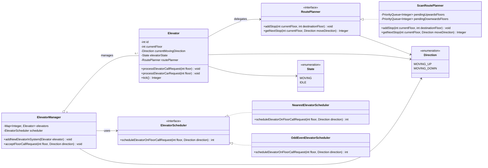

```mermaid
classDiagram
direction LR

class Elevator {
  -int id
  -int currentFloor
  -Direction currentMovingDirection
  -State elevatorState
  -RoutePlanner routePlanner
  +processElevatorCallRequest(int floor) void
  +processElevatorCarRequest(int floor) void
  +tick() Integer
}

class ElevatorManager {
  -Map~Integer, Elevator~ elevators
  -ElevatorScheduler scheduler
  +addNewElevatorInSystem(Elevator elevator) void
  +acceptFloorCallRequest(int floor, Direction direction) void
}

class NearestElevatorScheduler {
  +scheduleElevatorOnFloorCallRequest(int floor, Direction direction) int
}

class OddEvenElevatorScheduler {
  +scheduleElevatorOnFloorCallRequest(int floor, Direction direction) int
}

class ScanRoutePlanner {
  -PriorityQueue~Integer~ pendingUpwardsFloors
  -PriorityQueue~Integer~ pendingDownwardsFloors
  +addStop(int currentFloor, int destinationFloor) void
  +getNextStop(int currentFloor, Direction moveDirection) Integer
}

class ElevatorScheduler {
  <<interface>>
  +scheduleElevatorOnFloorCallRequest(int floor, Direction direction) int
}

class RoutePlanner {
  <<interface>>
  +addStop(int currentFloor, int destinationFloor) void
  +getNextStop(int currentFloor, Direction moveDirection) Integer
}

class Direction {
  <<enumeration>>
  MOVING_UP
  MOVING_DOWN
}

class State {
  <<enumeration>>
  MOVING
  IDLE
}

ElevatorManager "1" o-- "0..*" Elevator : manages
ElevatorManager --> ElevatorScheduler : uses
Elevator --> RoutePlanner : delegates
RoutePlanner <|.. ScanRoutePlanner
ElevatorScheduler <|.. NearestElevatorScheduler
ElevatorScheduler <|.. OddEvenElevatorScheduler

Elevator --> Direction
Elevator --> State
ElevatorManager --> Direction
RoutePlanner --> Direction

```