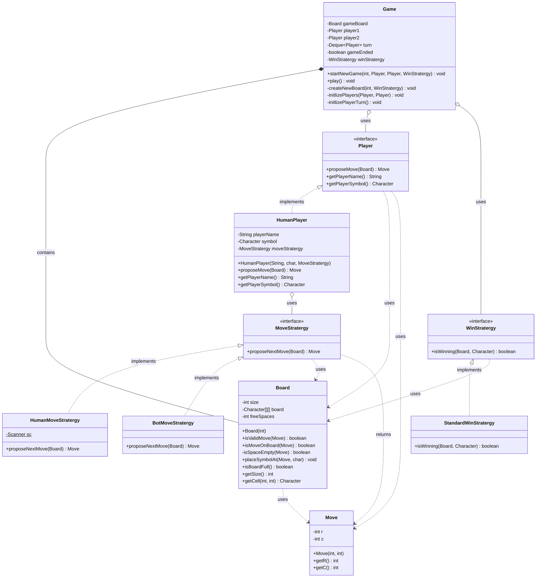

# Tic Tac Toe - UML Class Diagram

## Design Patterns Used

1. **Strategy Pattern**
   - `MoveStratergy`: Encapsulates different move algorithms (Human, Bot)
   - `WinStratergy`: Encapsulates win condition checking logic

2. **Interface Segregation**
   - `Player`: Common interface for all player types
   - Allows flexibility to add different player types (Human, Bot, AI, etc.)

## Key Design Decisions

- **Composition over Inheritance**: `HumanPlayer` uses `MoveStratergy` rather than inheriting from different player types
- **Single Responsibility**: Each class has a focused purpose
- **Open/Closed Principle**: Easy to add new strategies without modifying existing code
- **Dependency Injection**: Strategies are injected into players and game

## Class Responsibilities

| Class | Responsibility |
|-------|---------------|
| `Game` | Orchestrates game flow, manages turns, checks win/draw conditions |
| `Board` | Maintains game state, validates moves, tracks available spaces |
| `Move` | Encapsulates move coordinates |
| `HumanPlayer` | Represents a human player with name, symbol, and move strategy |
| `HumanMoveStratergy` | Gets move input from console |
| `BotMoveStratergy` | Generates automated moves (first available space) |
| `StandardWinStratergy` | Checks rows, columns, and diagonals for win condition |
