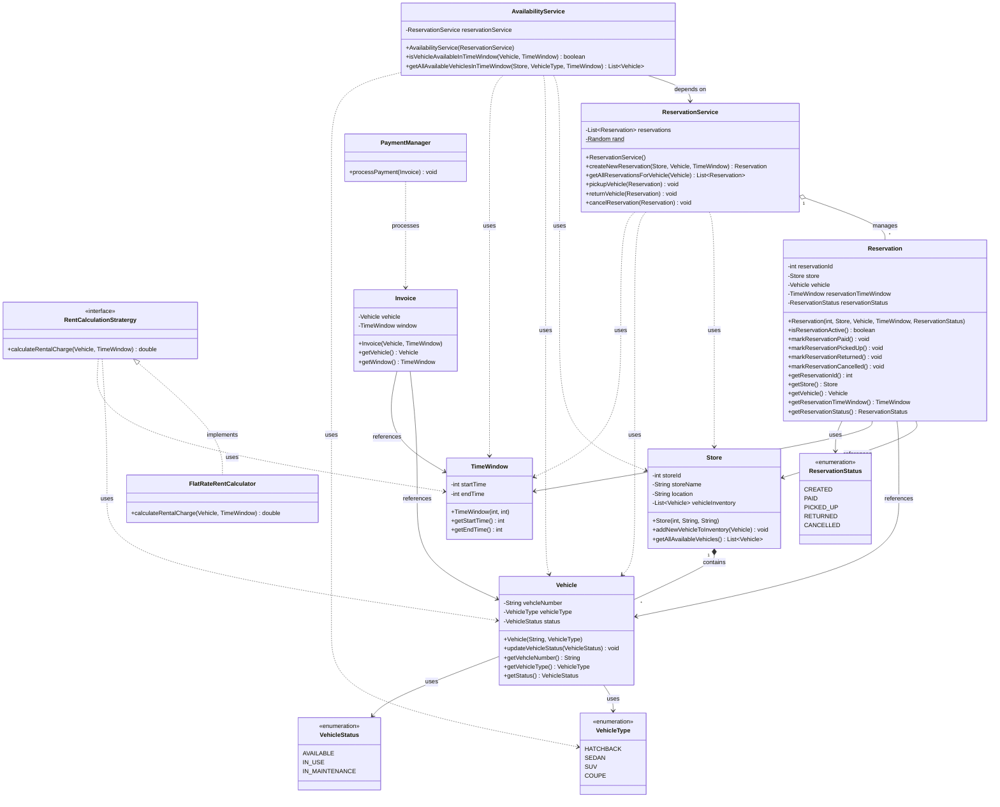

# ZoomCar - UML Class Diagram

## Design Patterns Used

1. **Strategy Pattern**
   - `RentCalculationStratergy`: Encapsulates different rent calculation algorithms
   - Allows flexible pricing models (FlatRate, Hourly, Dynamic, etc.)

2. **Service Layer Pattern**
   - `ReservationService`: Manages reservation lifecycle
   - `AvailabilityService`: Handles availability checks and queries
   - `PaymentManager`: Processes payment operations

3. **Domain-Driven Design**
   - Clear separation between entities, services, and value objects
   - Rich domain models with business logic encapsulated in entities

## Key Design Decisions

- **Composition over Inheritance**: Services use composition to collaborate
- **Single Responsibility**: Each class has a focused purpose
- **Enum for State Management**: Type-safe status and type definitions
- **Time Window Abstraction**: Reusable time range representation
- **Separation of Concerns**: Availability logic separated from reservation management

## Class Responsibilities

| Class | Responsibility |
|-------|---------------|
| `Store` | Manages vehicle inventory for a specific location |
| `Vehicle` | Represents a rentable vehicle with its type and status |
| `Reservation` | Encapsulates booking information and lifecycle |
| `ReservationService` | Handles reservation CRUD operations |
| `AvailabilityService` | Checks vehicle availability and prevents double booking |
| `TimeWindow` | Value object representing a time interval |
| `Invoice` | Contains billing information for a reservation |
| `PaymentManager` | Processes payment transactions |
| `FlatRateRentCalculator` | Implements flat-rate pricing strategy |

## System Flow

1. **Search Availability**: User searches for available vehicles in a time window
   - `AvailabilityService` checks vehicle status and existing reservations
   
2. **Create Reservation**: User books an available vehicle
   - `ReservationService` creates new reservation with CREATED status
   
3. **Payment**: User pays for the reservation
   - `PaymentManager` processes payment
   - Reservation status updates to PAID
   
4. **Pickup**: User picks up the vehicle
   - Reservation status updates to PICKED_UP
   - Vehicle status changes to IN_USE
   
5. **Return**: User returns the vehicle
   - Reservation status updates to RETURNED
   - Vehicle status changes to AVAILABLE

## Extensibility

The system can be easily extended with:
- New pricing strategies (Dynamic pricing, Weekend rates, etc.)
- Additional vehicle types
- More reservation statuses
- Different payment methods
- Location-based pricing
